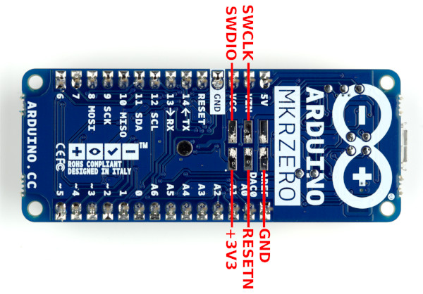
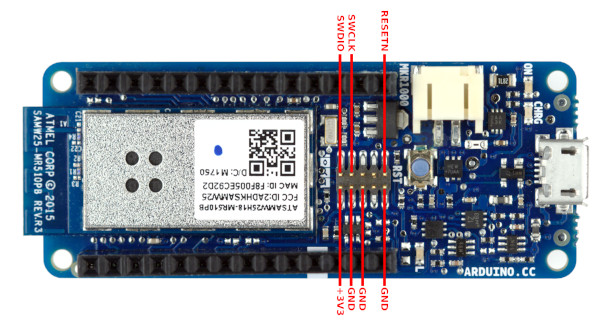
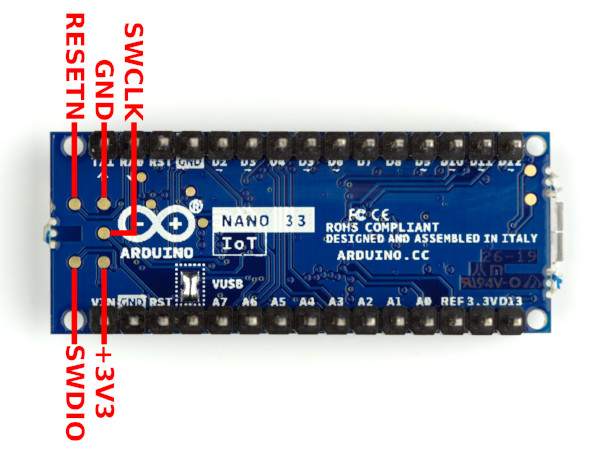

Note: Only the Arduino IDE has **Burn Bootloader** functionality. It is not possible to do this via [Arduino Web Editor](https://create.arduino.cc/editor) or [arduino-cli](https://github.com/arduino/arduino-cli).

---

### General troubleshooting advice

---

<a id="burn-bootloader"></a>

#### How do I burn the bootloader to my AVR board?

The following instructions are for targets that use the AVR architecture (e.g., Uno, Nano, Leonardo, Mega).

You will need an ISP programmer. If you don't have a programmer, you can use a spare Arduino board as an "Arduino as ISP" programmer. Although the "Arduino as ISP" only works for programming targets of the AVR architecture, you can use boards of any architecture as an "Arduino as ISP" programmer.

Instructions:

1. Make the following connections between the Arduino board you will be using as the programmer and the target. Refer to the "Connections" table on the [SPI library reference page](https://www.arduino.cc/en/Reference/SPI) to determine the pins:

   | Programmer | Target                      |
   | ---------- | --------------------------- |
   | MISO       | MISO                        |
   | VCC        | 5V (or VCC on 3.3 V boards) |
   | SCK        | SCK                         |
   | MOSI       | MOSI                        |
   | 10         | RESET                       |
   | GND        | GND                         |

1. Connect the programmer board to your computer with a USB cable.
1. **File > Examples > 11.ArduinoISP > Arduino ISP**
1. Select the port of your board from the **Tools > Port** menu.
1. **Sketch > Upload**
1. Wait for the upload to finish.

You are now ready to burn the bootloader using your "Arduino as ISP" programmer.

Instructions for burning the bootloader:

1. Connect an ISP programmer to the ICSP header on your Arduino board.
1. Select the _target_ board from the **Tools > Board** menu and any other custom **Tools** menus (e.g. **Tools > Processor**).
1. Select the appropriate programmer from the **Tools > Programmer** menu.
1. **Tools > Burn Bootloader**
1. Wait for the process to finish successfully.

You can also use your ISP programmer to upload sketches to the target board via **Sketch > Upload Using Programmer**. Note that when you do this, the bootloader is erased. After using **Upload Using Programmer**, you would need to do another **Burn Bootloader** before you can go back to uploading to the target board normally via the USB cable.

---

#### How do I burn the bootloader to my MKR or Nano 33 IoT board?

You'll need:

- An extra Arduino board that runs at 3.3 V.
  - It is possible to use an Arduino board that runs at 5 V as the programmer, but you'll need to use level shifting circuitry on the programming lines to avoid exposing the target board to 5 V logic levels, which would damage it.
- An SD slot. This could be built into your Arduino board (e.g., [MKR Zero](https://store.arduino.cc/arduino-mkr-zero-i2s-bus-sd-for-sound-music-digital-audio-data)), a shield (e.g., [MKR SD Proto Shield](https://store.arduino.cc/mkr-sd-proto-shield)), or one of the common SD modules.
- An SD card that fits your SD slot.
- A way to connect the SD card to your computer.
- A way to make the connections to the SWD pins on your target Arduino board:
  - MKR1000: The SWD header is a 0.05" pitch 2x5 male header on the top of the board.
    - You will need an adapter, something like [this one](https://www.aliexpress.com/item/32924937649.html).
  - Other MKR boards and Nano 33 IoT: The SWD header is a 2x3 footprint or test pads on the bottom of the board.
    - You can use a 0.1" pitch 2x3 POGO adapter like [this one](https://www.sparkfun.com/products/11591).
    - You can solder wires to the test points.
    - On the MKR boards, it is the footprint for a 0.1" pitch SMD header (e.g., <https://www.digikey.com/short/z3dvdv>).

Instructions:

1. Connect an SD card to your computer.
1. Open this link in your browser: <https://github.com/arduino/ArduinoCore-samd/tree/master/bootloaders>
1. Click the folder that matches the name of your target board.
1. Click the file that ends in `.bin`
1. Click the "Download" button.
1. Rename the downloaded file to `fw.bin`
1. Move `fw.bin` to the SD card.
1. Eject the SD card from your computer.
1. Plug the USB cable of the Arduino board you will be using as a programmer into your computer.
1. (In the Arduino IDE) **Sketch > Include Library > Manage Libraries**
1. Wait for the download to finish.
1. In the "Filter your search..." field, type "Adafruit DAP library".
1. Press "Enter".
1. Click on "Adafruit DAP library by Adafruit".
1. Click the "Install" button.
1. Wait for the installation to finish.
1. Click the "Close" button.
1. **File > Examples > Adafruit DAP library > flash_from_SD**
1. Change this line:
   ```c++
   #define SD_CS 4
   ```
   according to the Arduino pin connected to the SD CS pin. If your board has a built-in SD slot (e.g., MKR Zero), then you can change this line:
   ```c++
   if (!SD.begin(SD_CS)) {
   ```
   to:
   ```c++
   if (!SD.begin()) {
   ```
1. Select the correct board from the **Tools > Board** menu.
1. Select the correct port from the **Tools > Port** menu.
1. **Sketch > Upload**
1. Wait for the upload to finish successfully.
1. Unplug the programmer Arduino board from your computer.
1. Plug the SD card into the SD slot connected to your Arduino board.
1. Connect the programmer Arduino board to the target Arduino board (see pinout diagrams below) as follows:

   | Programmer | Target |
   | ---------- | ------ |
   | VCC        | +3V3   |
   | 10         | SWDIO  |
   | 9          | SWCLK  |
   | GND        | GND    |
   | 11         | RESETN |

1. Plug the USB cable of the programmer Arduino board into your computer.
1. Tools > Serial Monitor. You should now see the target board detected, and the bootloader file flashed to it successfully.
1. Unplug the programmer Arduino board from your computer.
1. Disconnect the programmer Arduino board from the target Arduino board.

Note: another alternative is to use a J-Link debug probe (J-Link EDU Mini and J-Link clones are available for a low price) with the Adalink software:
<https://github.com/adafruit/Adafruit_Adalink>

SWD pinout diagrams:

MKR boards other than MKR 1000
{:refdef: style="text-align: center"}

{: refdef}

MKR 1000
{:refdef: style="text-align: center"}

{: refdef}

Nano 33 IoT
{:refdef: style="text-align: center"}

{: refdef}

---

#### How do I burn the bootloader to my Arduino Zero?

The Zero has a built-in programmer, which makes burning the bootloader very easy.

1. Connect a USB cable to the "Programming Port" of the Zero.
1. Plug the USB cable of the Zero into your computer.
1. **Tools > Board > Arduino Zero (Programming Port)**
1. **Tools > Programmer > Atmel EDBG**
1. **Tools > Burn Bootloader**. The Burn Bootloader process should now proceed successfully.

---

#### How do I burn the bootloader to my Uno WiFi Rev2?

The Uno WiFi Rev2 has a built-in programmer, which makes burning the bootloader very easy.

1. Plug the USB cable of the Uno WiFi Rev2 into your computer.
1. **Tools > Board > Arduino Uno WiFi Rev2**
1. **Tools > Programmer > Onboard Atmel mEDBG (UNO WiFi Rev2)**
1. **Tools > Burn Bootloader**. The Burn Bootloader process should now proceed successfully.

---

#### Verbose output during **Burn Bootloader**

If the **Burn Bootloader** process is failing, it can be very helpful to check the verbose output to see what the problem is:

1. **File > Preferences**
1. Check the box next to "Show verbose output during: > upload".
1. Click the "OK" button.
1. Do the [**Burn Bootloader**](*burn-bootloader).
1. After the process fails, check the output in the black console window at the bottom of the Arduino IDE window. You may need to scroll up to see it all.

---

### Specific issues

---

#### `avrdude: warning: cannot set sck period. please check for usbasp firmware update.`

This is normal with the common USBasp clones and does not indicate a problem. If you are having a problem burning the bootloader, this is not the cause. It is possible to upgrade the USBasp firmware, but it's a somewhat advanced process so you should only upgrade if you actually need the features of the new firmware version.

---

<a id="device-signature"></a>

#### `avrdude: Device signature = 0x000000` or `avrdude: Device signature = 0xffffff` or `avrdude: Device signature = {some random wrong signature}`, `avrdude: Yikes! Invalid device signature.`

<!--
- `avrdude: Device signature = 0x000000`
  - Target not powered.
  - MISO/MOSI/SCK/RST not connected
  - MOSI/SCK swapped with RST
  - MISO swapped with RST
  - RST-RST instead of 10-RST reset connection
  - ICSP cable backwards on header
- `avrdude: Device signature = {some random wrong signature}
  - MOSI/SCK swapped with MISO
- `avrdude: Device signature = 0xffffff`
  - MISO/RST swapped
-->

Carefully check the wiring between the programmer and target. If using an "Arduino as ISP" programmer, note that not all boards have the SPI bus on Arduino pins 11, 12, 13. Refer to the "Connections" table on the [SPI library reference page](https://www.arduino.cc/en/Reference/SPI) to determine your board's SPI pins.

If the target's fuses were set to use an external clock/resonator/crystal, but no external clock source is attached, you will not be able to program the target. The solution is to connect a clock source to the target long enough to set the fuses to use the internal oscillator, after which the external clock source will no longer be required. The Arduino IDE's **Burn Bootloader** process sets the fuses according to the definition of the currently selected board.

Make sure you have selected your target board from the **Tools > Board** menu.

---

#### `avrdude: stk500_getsync() attempt 1 of 10: not in sync: resp=0x{some code}`

Make sure you uploaded the **File > Examples > 11.ArduinoISP > Arduino ISP** sketch to the programmer board.

<!--
- This only happens on Windows. On Linux, either programmer selection works.
- Either programmer selection works on Windows or Linux with a SAMD board as programmer.
-->

If you're using an ATmega32U4-based board (e.g., Leonardo, Micro, Pro Micro, Yun) as an "Arduino as ISP" programmer, select "Arduino as ISP (ATmega32U4)" from the **Tools > Programmer** menu. If you don't see that programmer option in the **Tools > Programmer** menu, you need to update Arduino AVR Boards, following these instructions:

1. **Tools > Board > Boards Manager**
1. Wait for the downloads to finish.
1. Click on "Arduino AVR Boards".
1. Click the "Update" button.
1. Wait for the update to finish.
1. Click the "Close" button.

---

#### `avrdude: stk500_getparm(): (a) protocol error, expect=0x14, resp=0x10`, `avrdude: stk500_initialize(): (b) protocol error, expect=0x10, resp=0x01`, `avrdude: initialization failed, rc=-1`

<!--
Non-native USB board used with the `arduino` instead of `stk500v1` protocol.
The "Arduino as ISP programmer's protocol was changed from `stk500v1` to `arduino` protocols in Arduino AVR boards 1.6.22-1.6.23 (https://github.com/arduino/Arduino/issues/8032). This made it more likely that a reset disable capacitor would be needed.
I can only reproduce this on Linux. On Windows, the "arduino" and "stk500v1" protocols both work (tested with Uno w/ CH340 and Mega w/ ATmega16U2).
The "Arduino as ISP" programmer's protocol was changed back to `stk500v1` in Arduino AVR Boards 1.8.1 (https://github.com/arduino/ArduinoCore-avr/pull/56), and an "Arduino as ISP (ATmega32U4)" programmer was added with the `arduino` protocol.
-->

Make sure you're using Arduino AVR Boards 1.8.1 or newer. You can check the Arduino AVR Boards version and upgrade if necessary by following these instructions:

1. **Tools > Board > Boards Manager**
1. Wait for the download to finish.
1. Click on "Arduino AVR Boards".
1. Click the "Update" button.
1. Wait for the update to finish.
1. Click the "Close" button.

If the problem still occurs with Arduino AVR Boards 1.8.1 or newer, connect a 10 uF capacitor between the GND and RST pins on the "Arduino as ISP" programmer board.

---

#### `avrdude: Error: Could not find USBtiny device (0x2341/0x49)` / `avrdude: Error: Could not find USBtiny device (0x2a03/0x49)` while using an "Arduino as ISP" programmer

This is caused by using the "ArduinoISP" or "ArduinoISP.org" Programmer menu selections when using the Arduino as ISP programmer. You need to select **Tools > Programmer > Arduino as ISP**.

---

#### How do I use `-F` to override AVRDUDE's signature check?

<!-- `Expected signature for ... is ...`, `Double check chip, or use -F to override this check.` -->

Although AVRDUDE suggests overriding the signature check via the `-F` command line flag, this would only be helpful in extremely rare cases where the chip's signature has somehow been corrupted. Much more often, the signature check fails because [the programmer is incorrectly connected to the target or the wrong board was selected](#device-signature). In those cases, disabling the signature check won't solve the problem.

---

#### `avrdude: error: program enable: target doesn't answer. 0 `, `avrdude: initialization failed, rc=-1`

<!-- https://github.com/arduino/avrdude-build-script/issues/1 -->

This error is caused by using the libusb-win32 driver with Arduino's version of AVRDUDE. The solution is to use the libusbK driver instead:

1. Download Zadig: <https://zadig.akeo.ie>. Note that Zadig is recommended on the [official USBasp website](https://www.fischl.de/usbasp).
1. Plug in your USBasp
1. Start Zadig
1. From the dropdown menu, select USBasp. If it doesn't show up on the menu, select **Options > List all devices** and check again.
1. Click the up or down arrows next to the Driver selection box on the right side until you see libusbK.
1. Click the "Replace Driver" button.
1. Wait for the driver installation to finish.
1. Close Zadig.

---

#### `avrdude: error: program enable: target doesn't answer. 1`, `avrdude: initialization failed, rc=-1`

<!--
USBasp
USBtinyISP (but it only causes the `avrdude: initialization failed, rc=-1` part of the error)
-->

Make sure the programmer's cable is correctly connected to the target board. Pin 1 on the cable is indicated by a small triangle embossed on the plastic. Pin 1 on the Arduino board's ICSP header is indicated by a white dot on the PCB's silkscreen.

<!--
This does not occur with https://github.com/PeterVH/usbasp/tree/v1.06 or the firmware that comes on the "baite" branded USBasp
-->

If your USBasp programmer has the official firmware, you must short the JP3 jumper to program chips that are running at <=1 MHz clock speed. The factory default clock configuration is running on the internal oscillator at 1 MHz. Many of the common Chinese USBasp clones come with a modified firmware that is able to work with chips running at the slower clock speeds without needing to set the jumper. There is also a [alternate open source firmware](https://github.com/PeterVH/usbasp/tree/v1.06) provided by the community that has this functionality.

---

#### `avrdude: stk500v2_program_enable(): bad AVRISPmkII connection status: RST fail, Target reverse inserted`

Make sure the programmer's cable is correctly connected to the target board. Pin 1 on the cable is indicated by a small triangle embossed on the plastic. Pin 1 on the Arduino board's ICSP header is indicated by a white dot on the PCB's silkscreen.
