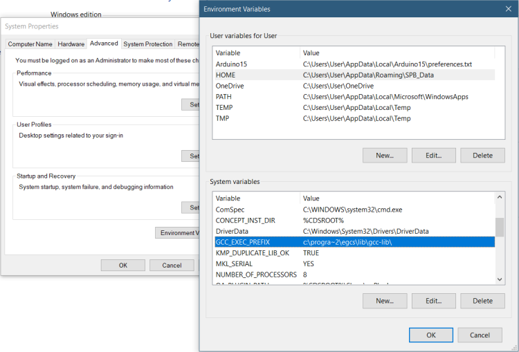

---
### General troubleshooting advice
---

#### Look at the error messages
When the compilation fails, you will see an error message on the orange bar, but this doesn't provide much information. You will find detailed error messages in the black console window at the bottom of the Arduino IDE window. You will need to scroll the window up to see it all.


---
#### Warning vs error
It's important to understand the difference between warnings and errors. A warning is the compiler telling you there is something in the code that could possibly cause a problem, but doesn't cause the compilation to fail. Compiler warnings start with "warning:". An error is a problem that causes compilation to fail. Compiler error start with "error:". It's a good idea to pay attention to warnings, as they often provide helpful information. However, warnings don't always indicate a serious problem. When the warning is caused by code in a library, often the best course is to ignore it and carry on.


---
#### Interpreting compiler errors
The error message follows a standard form: `{filename}:{line number}:{column number}: error: {error message}`. On the next line, the line of code where the error occurred is shown. On the next line, a caret (^) points to the column where the error occurred in the code.


---
#### Check for mismatched braces
A very helpful troubleshooting tool is the Auto Format feature (**Tools > Auto Format** in the Arduino IDE, **Ctrl + B** in the [Arduino Web Editor](https://create.arduino.cc/editor), **Right Click > Format Document** in [Arduino Pro IDE](https://github.com/arduino/arduino-pro-ide)). If you do an Auto Format and then compare the resulting indentation to your intended program structure, it will quickly point you to where there is a missing or extra brace.

Another useful feature of the Arduino IDE/[Arduino Web Editor](https://create.arduino.cc/editor) is that when you place the cursor next to one bracket, it puts a box around the matching bracket. In the Arduino IDE, if the cursor is next to the closing bracket and the opening bracket is off the screen then it will show the opening bracket line in a tool tip after a short delay.

In the Arduino IDE, **Ctrl + {** will cause the cursor to jump from one bracket to its matching bracket.


---
### Specific issues
---

#### `exit status 1`
This is a generic error message that only tells you something went wrong. Look at the contents of the black console window at the bottom of the Arduino IDE window to see the detailed error messages to find out exactly what the problem is. You will need to scroll the console window up to see it all.


---
#### `No such file or directory`
This error usually means you haven't installed a library that your code requires. Some libraries have dependencies on other libraries.

Often the code you're compiling will come with documentation (either a comment or separate document) that tells you where to get the library dependencies.

In other cases the author of the code will not have been so kind and you'll need to go on a hunt for the missing library.

A good place to start is the Arduino IDE's Library Manager:
1. **Sketch > Include Library > Manage Libraries...**
1. In the "Filter your search..." box, type some keywords you have gleaned from the missing file name.
1. Scroll through the results for the right library. Click on it.
1. Click "Install".
1. Wait for installation to finish.
1. Click "Close".
1. Try compiling your code again.

If you have no luck in Library Manager, then load up your favorite search engine and do a search for the missing filename. You will often get multiple results. If you have a lot of results you can add "arduino" as an additional search keyword. You might give preference to results on github.com since that is where most Arduino libraries are hosted and downloading from there is fast and easy.

In some cases, there will be multiple libraries that contain the given filename and you'll need to do some evaluation to determine which seems the most appropriate, then try it out.

After downloading the library you found you'll need to install it. This requires a different process than the Library Manager installation. You will find instructions here:
<https://www.arduino.cc/en/Guide/Libraries#toc4>


---
#### `ar.exe: unable to rename 'core\core.a'`
This error may be caused by overzealous antivirus software. Try **TEMPORARILY** disabling your antivirus for a single compilation to see if the problem goes away, then turn the antivirus back on. If the problem doesn't occur with the antivirus off you will need to adjust the settings of your antivirus to whitelist the appropriate file, folder, or process so it doesn't interfere with compilation.


---
#### `Sketch too big`
Your sketch uses more program (flash) memory than is available on your board.

If you have the same sequence of code statements in two or more places, consider making a function out of them.

Use of the [`String`](https://www.arduino.cc/reference/en/language/variables/data-types/stringobject/) type can increase the memory usage of your sketch. Instead use [strings](https://www.arduino.cc/reference/en/language/variables/data-types/string/) (null-terminated `char` arrays) with the cstring functions:
<http://www.cplusplus.com/reference/cstring/>


---
#### `Not enough memory`
Your sketch uses more dynamic (SRAM) memory for global variables than is available on your board.

An easy way to reduce the dynamic memory usage of your sketch is via the `F()` macro:
<https://www.arduino.cc/reference/en/language/variables/utilities/progmem/#_the_code_f_code_macro>

Use the smallest possible type for variables. For example, if a variable only ever needs to hold values between 0 and 255, use the `byte` type instead of `int`.

Use of the [`String`](https://www.arduino.cc/reference/en/language/variables/data-types/stringobject/) type can increase the memory usage of your sketch. Instead use [strings](https://www.arduino.cc/reference/en/language/variables/data-types/string/) (null-terminated `char` arrays) with the cstring functions:
<http://www.cplusplus.com/reference/cstring/>


---
#### `lto1.exe: internal compiler error: Segmentation fault`
This bug is specific to the 5.4.0-atmel3.6.1-arduino2 version of avr-gcc used by Arduino AVR Boards 1.6.22 and 1.6.23. The solution is to update to the latest version of Arduino AVR Boards:
1. **Tools > Board > Boards Manager**
1. Wait for downloads to finish.
1. Click on "Arduino AVR Boards by Arduino".
1. Click "Update".
1. Wait for the update to finish.
1. Click "Close".

<!-- https://github.com/arduino/Arduino/issues/7973 -->
Due to a bug, this fix doesn't work with Arduino IDE 1.8.6, but it will work with any other version of the Arduino IDE.


---
#### `lto1.exe: internal compiler error: in lto_output_varpool_node, at lto-cgraph.c:624`
This bug is specific to the 5.4.0-atmel3.6.1-arduino2 version of avr-gcc used by Arduino AVR Boards 1.6.22 and 1.6.23. The solution is to update to the latest version of Arduino AVR Boards:
1. **Tools > Board > Boards Manager**
1. Wait for downloads to finish.
1. Click on "Arduino AVR Boards by Arduino".
1. Click "Update".
1. Wait for the update to finish.
1. Click "Close".

<!-- https://github.com/arduino/Arduino/issues/7973 -->
Due to a bug, this fix doesn't work with Arduino IDE 1.8.6, but it will work with any other version of the Arduino IDE.


---
#### `Invalid library found in...`
This is only a helpful warning from the Arduino IDE telling you that it found something other than a library in your libraries folder. This won't cause any actual problems unless your code requires a library that was incorrectly installed (in which case you would likely get a "No such file or directory" error). If you want to fix the warning, move the folder specified in the warning somewhere else or install the library correctly.


---
#### `Board x (platform y, package z) is unknown`
<!-- This no longer occurs in Arduino IDE 1.8.10 -->
("x", "y", and "z" being dependent on the board selection) This problem is caused by the the Arduino IDE not fully removing the previous hardware package version when you updated to a new version via Boards Manager. It is solved by completely removing the old package version:
1. **File > Preferences**
1. Click the link at the line following "More preferences can be edited directly in the file". This will open the `Arduino15` (or similar name depending on OS) folder.
1. Open the `packages` subfolder. This folder contains a subfolder for each of the vendor names of the hardware packages you have installed via Boards Manager.
1. Open the vendor folder ("z" in the example error message above) of the problematic hardware package.
1. Open the `hardware` subfolder.
1. Open the architecture subfolder ("y" in the example error message above) of the problematic hardware package.
1. You will now see multiple version subfolders. One of these folders is the one you upgraded from that was not fully removed. Delete that folder. Please be very careful when deleting files on your computer, when in doubt back up!


---
#### Compilation is very slow
The Arduino IDE/[arduino-cli](https://github.com/arduino/arduino-cli)/[Arduino Pro IDE](https://github.com/arduino/arduino-pro-ide) creates many processes during compilation. Some antivirus software will do an "on access" scan of every process, which slows down compilation tremendously. To determine whether this is the problem by **TEMPORARILY** disabling your antivirus software for a single compilation, then enabling it again immediately after. If the compilation speed was improved, then you will need to whitelist the appropriate processes/files/folders in your antivirus software.

Note that the Arduino development software caches compiled files. The cached files are only recompiled if their source code has been modified. So subsequent compilations will be faster than the first one. Be sure to not allow this to throw off the results of your compilation speed tests.


---
<a id="delete-arduino15"></a>
#### `fork/exec ... : no such file or directory` or `exec: ... : file does not exist` or `Cannot run program "___REMOVE___...`
Some hardware packages have dependencies on other packages. For example, Adafruit SAMD Boards requires that Arduino SAMD Boards also be installed. Attempting to compile for a board of a hardware package without the package dependency installed can cause this error. Check the installation instructions for the hardware package of the board you're compiling for to see if there are any dependencies.

Otherwise, this error indicates something has gone wrong with a hardware package installed via Boards Manager. The solution is to remove the installed packages. Be aware this will remove any boards you have installed via Boards Manager:
1. (In the Arduino IDE) **File > Preferences**
1. Click the link on the line following "More preferences can be edited directly in the file". This will open the `Arduino15` (or similar name depending on OS) folder.
1. Delete all files and folders under the `Arduino15` folder except for preferences.txt. Please be very careful when deleting things from your computer. When in doubt, back up!
1. Restart the Arduino IDE
1. If the board you are using requires Boards Manager (**Tools > Board > Boards Manager**) installation, re-install its hardware package.

Verify that you can now use your board before reinstalling any other packages via Boards Manager.


---
#### `Multiple libraries were found for`
The "Multiple libraries were found for" message has nothing to do with your problem. That's just some helpful information the Arduino IDE provides. Generally, you can safely ignore the "Multiple libraries were found for" messages. The only time you need to pay attention to it is when the Arduino IDE picked a different library than the one you had intended.

Scroll up the black console window at the bottom of the Arduino IDE window to see the real error message related to your problem.

Note that there is a bug in Arduino IDE 1.8.10 that causes it to display "Multiple libraries were found for" messages even when there were no multiple libraries. You'll know the legitimate "Multiple libraries were found for" messages because they'll show the path to a library that was not used. The false "Multiple libraries were found for" messages only show the path to the library that was used.

Example of a legitimate "Multiple libraries were found for" message:
```
Multiple libraries were found for "Servo.h"
 Used: C:\Users\rachel\Documents\Arduino\libraries\Servo
 Not used: E:\Arduino\libraries\Servo
```
Example of a spurious "Multiple libraries were found for" message:
```
Multiple libraries were found for "SPI.h"
 Used: E:\Arduino\hardware\arduino\avr\libraries\SPI
```


---
#### `panic: Failed to find GetFileInformationByHandleEx procedure in kernel32.dll`
Support for Windows XP was lost in Arduino IDE 1.8.10. Please use Arduino IDE 1.8.9 with Windows XP. You can download Arduino IDE 1.8.9 here:
<https://www.arduino.cc/en/Main/OldSoftwareReleases>


---
#### `avr-g++: error: device-specs/specs-...: No such file or directory`
<!-- https://forum.arduino.cc/index.php?topic=627042.msg4256780#msg4256780 -->
1. **Win + r**
1. Type "sysdm.cpl".
1. Click the "OK" button. "System Properties" should now open.
1. Click the "Advanced" tab.
1. Click the "Environment variables..." button.
1. Under "System variables", scroll down until you see "GCC_EXEC_PREFIX". Click on it.
1. Click the "Delete" button.
1. Click the "OK" button.
1. Close System Properties.

{:refdef: style="text-align: center"}

{: refdef}


---
#### `'import' does not name a type`
This is caused by trying to compile a Processing sketch as an Arduino sketch. Arduino sketches sometimes come with companion Processing sketches, and Processing sketches even have the `.pde` file extension supported for Arduino sketches. However, Processing sketches are programs that run on a computer, not an Arduino board, and must be used with the [Processing IDE](https://processing.org/).


---
#### `Symbol not found: _environ`
Arduino AVR Boards 1.6.12 and newer require macOS 10.8 Mountain Lion or newer. If you want to use an older version of macOS, you will need to roll back to the last compatible version of Arduino AVR Boards:
1. **Tools > Board > Boards Manager**
1. Wait for the downloads to finish.
1. Click on "Arduino AVR Boards".
1. Select "1.6.11" from the "select version" drop down menu.
1. Click "Install".
1. Wait for installation to finish.
1. Click "Close".

<!-- https://github.com/arduino/Arduino/issues/7973 -->
Due to a bug, this workaround doesn't work with Arduino IDE 1.8.6, but it will work with any other version of the Arduino IDE.

If you have update notifications enabled (**File > Preferences > Check for updates on startup**), you will need to refrain from updating Arduino AVR Boards when you get the notifications that a newer version is available.


---
#### `Readlink ...: The system cannot find the file specified.`
This error is caused by using Arduino IDE 1.8.5 or older with files stored in Windows OneDrive. The solution is to update to Arduino IDE 1.8.6 or newer.


---
#### `error: 'StaticJsonBuffer'` or `error: 'DynamicJsonBuffer'`
This error means you're using a version of ArduinoJson library that is not compatible with your code. The ArduinoJson library 6.x.x versions have breaking changes that make them not work with code written for the ArduinoJson 5.x.x versions. The solution is to install the newest 5.x.x version of the library:
1. **Sketch > Include Library > Manage Libraries...**
1. Wait for the download to finish.
1. In the "Filter your search..." box, type "arduinojson".
1. In the search results, click on "ArduinoJson by Benoit Blanchon"
1. From the dropdown version menu, select "5.13.5".
1. Click "Install".
1. Wait for the installation to finish.
1. Click "Close".

If you have update notifications enabled (**File > Preferences > Check for updates on startup**), you will need to refrain from updating the ArduinoJson library when you get the notifications that a newer version is available.
